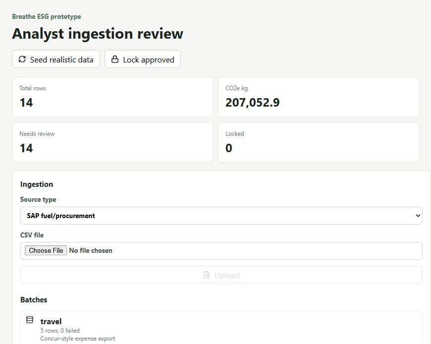

# Breathe ESG Prototype

A deployed Django REST + React prototype for ingesting messy enterprise ESG activity data, normalizing it, and giving analysts a review workflow before rows are locked for audit.

**Live app:** https://breathe-esg-prototype-p5tl.onrender.com



## Overview

Breathe ESG receives emissions and activity data from different client systems. This prototype demonstrates a focused ingestion and analyst review flow for three realistic source types:

- SAP fuel and procurement exports
- Utility electricity meter exports
- Corporate travel expense exports

The app converts each source into a common `EmissionActivity` model, flags suspicious rows, and lets an analyst approve, reject, or lock approved rows for audit.

## Features

- Django REST API with normalized ESG activity models
- React analyst dashboard
- CSV ingestion for SAP, utility, and travel data
- Realistic sample data included in `sample_data/`
- Unit normalization for litres, kWh/MWh, km/miles, hotel nights, and spend
- Suspicion flags for missing facilities, unusual quantities, long billing periods, and missing travel distance
- Review actions with audit events
- Audit locking for approved rows
- Render deployment configuration included

## Tech Stack

- Backend: Django, Django REST Framework, SQLite
- Frontend: React, Vite, Lucide icons
- Deployment: Render, Gunicorn, WhiteNoise

## Project Structure

```text
backend/              Django project and ingestion API
frontend/             React dashboard
sample_data/          Realistic CSV samples for the three source types
MODEL.md              Data model explanation
DECISIONS.md          Product and implementation decisions
TRADEOFFS.md          Deliberate omissions and tradeoffs
SOURCES.md            Source research notes and references
render.yaml           Render deployment blueprint
```

## Local Setup

```powershell
py -m venv .venv
.\.venv\Scripts\pip install -r requirements.txt
.\.venv\Scripts\python backend\manage.py migrate
.\.venv\Scripts\python backend\manage.py runserver
```

In a second terminal:

```powershell
npm install
npm run dev
```

Open the Vite URL and click **Seed realistic data**.

## Verification

```powershell
.\.venv\Scripts\python backend\manage.py test ingest
npm run build
```

## Deployment

The app is deployed on Render:

https://breathe-esg-prototype-p5tl.onrender.com

Render uses `render.yaml` with:

- `npm ci && npm run build`
- `pip install -r requirements.txt`
- `python manage.py collectstatic --noinput`
- `python manage.py migrate`
- `gunicorn config.wsgi`

Production settings are controlled through environment variables such as `DEBUG`, `SECRET_KEY`, and `ALLOWED_HOSTS`.
